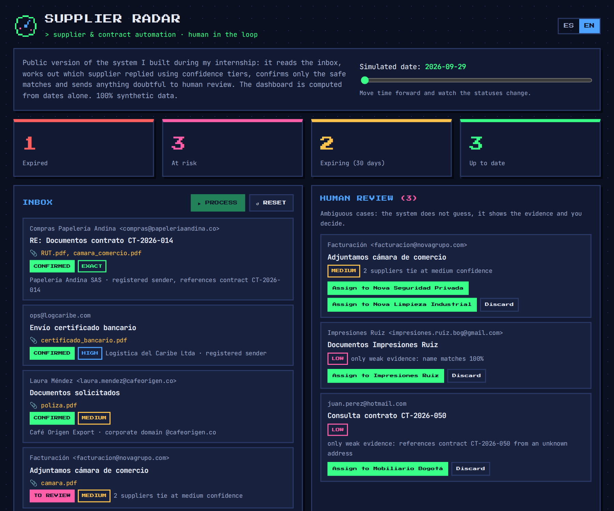
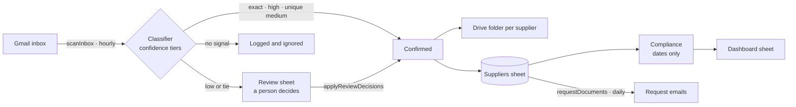

<div align="center">

# 📡 Supplier Radar

**Supplier and contract compliance automation on Google Workspace.**<br>
Confidence-tiered email matching · human-in-the-loop review · dashboards computed from dates only.

[](https://github.com/Dsergio909/supplier-radar/actions/workflows/ci.yml)


[**▶ Live demo**](https://dsergio909.github.io/supplier-radar/) · [🇪🇸 Resumen en español](#-resumen-en-español)



</div>

## The problem

Keeping supplier documents and contracts up to date meant sending requests one by one, digging replies out of Gmail and trusting a spreadsheet "status" column that, in practice, nobody kept current.

During my internship in purchasing at Smart Training Society I built, on my own initiative and with no budget, a system on Google Workspace that does this automatically. This repository is a **public, tested rebuild** of that design with synthetic data. It contains no company code or data.

## What it does

1. **Requests documents.** Emails every supplier that has not been asked yet, from a template.
2. **Reads the replies.** Classifies each new inbox message with confidence tiers (below) and logs every decision with its evidence.
3. **Files what is certain.** Attachments from confirmed replies are saved to a Drive folder per supplier and the received date is recorded.
4. **Asks a human about the rest.** Ambiguous emails land in a review sheet with the evidence and candidate suppliers. A person types the right supplier id and the script applies it.
5. **Shows the real picture.** A dashboard of expired, at-risk, expiring and up-to-date suppliers, computed from dates only.

## How the matching works

| Tier | Evidence | Outcome |
|---|---|---|
| `exact` | Registered sender **and** the contract number in the email | Confirmed automatically |
| `high` | Registered sender | Confirmed automatically |
| `medium` | The supplier's corporate domain (gmail.com, hotmail.com and similar never count) | Confirmed if only one supplier matches |
| `low` | A similar company name, or a contract number sent from an unknown address | **Always** human review |

If two suppliers match at the same top tier, for example two companies of one group sharing a domain, the email goes to review. The system never guesses.

And no match is ever confirmed if Gmail could not authenticate the sender (SPF/DMARC). A forged "From" asking to change a supplier's bank account goes straight to a person, with a warning.

## Design decisions

- **Precision over recall.** A wrong automatic confirmation silently marks a supplier as compliant. A false "needs review" costs a person ten seconds. So only strong, unique evidence is automated.
- **Dates, not status fields.** Status is derived from contract end, request and reply dates. The manual status column is ignored, and the demo highlights where it has drifted from reality.
- **One logic, three runtimes.** `src/core` is plain JavaScript with no dependencies. It is loaded unchanged by Node (tests), the browser (demo) and Google Apps Script (production).
- **Explainable by design.** Every decision carries structured evidence (`{ code, ...params }`), rendered in Spanish or English for the audit log, the review sheet and the demo.
- **Zero paid tools.** Only Google Workspace built-ins: no Zapier, no Make, no external APIs.

## Security

| Risk | Mitigation |
|---|---|
| Spoofed sender (fake supplier, e.g. bank-account change fraud) | Automatic confirmation requires Gmail's SPF or DMARC `pass`; otherwise the email goes to human review marked "possible spoofing". |
| Formula injection: an email subject like `=IMPORTXML(...)` running in the sheet | Every email-controlled value is written as plain text. |
| Duplicate or racing executions (hourly trigger + manual run) | A script lock allows one execution at a time, and each message id is processed only once. |
| Leaking real data from this public repo | All names, addresses and contracts are fictional. Corporate domains use the reserved `.example` TLD. No company code or data. |
| Demo page (XSS, third parties) | Content is rendered with `textContent` only; a strict Content-Security-Policy allows scripts from the site itself and fonts from Google Fonts, nothing else. No cookies, trackers or forms. |
| CI supply chain | Workflows use read-only permissions and do not persist credentials; the project has zero npm dependencies. |

Known limit: the classifier reads text, not attachment contents. Someone who controls a supplier's real mailbox can still send documents, which is why the audit log keeps every decision.

## Architecture



## Project structure

```
src/core/classifier.js   confidence-tier matching
src/core/compliance.js   date-derived status and KPIs
src/core/messages.js     human-readable explanations (ES / EN)
src/data/sample.js       synthetic suppliers and emails
apps-script/Code.js      Gmail · Sheets · Drive adapter
apps-script/*.csv        template for the Proveedores sheet
demo/                    interactive browser demo
tests/                   unit tests, plus the Apps Script adapter run end-to-end
                         against in-memory fakes of SpreadsheetApp, GmailApp and DriveApp
```

## Run it

Requires Node 22+ and nothing else: there are no dependencies to install.

```bash
npm test          # runs the whole suite
```

To try the demo locally, open `demo/index.html` in a browser.

### Deploy to Google Apps Script

1. Create a Google Sheet with a tab named `Proveedores`. Import [`apps-script/Proveedores-plantilla.csv`](apps-script/Proveedores-plantilla.csv) to get the headers, then replace the example rows with your suppliers. Use the status codes `expired`, `at-risk`, `expiring` or `active` in `manualStatus`, or leave it empty.
2. Run `npm run build:gas`. It copies the core files into `apps-script/`.
3. In the sheet, open **Extensions → Apps Script** and create one script file per file in `apps-script/`, pasting its contents. If you use [clasp](https://github.com/google/clasp), push that folder instead.
4. Optional: add a script property `DRIVE_FOLDER_ID` with the id of the Drive folder where documents should be filed.
5. Reload the sheet and use the new **Supplier Radar** menu. **Instalar ejecución automática** schedules the inbox scan every hour and the requests every day.

## Roadmap

- **AI-assisted review.** For low-confidence cases, an LLM summarises the email and suggests a supplier as a hint. The decision stays human.
- Detect the document type (tax ID, bank certificate, etc.) from each attachment.
- Remind suppliers automatically before their contract expires.

## About

Built by **Sergio García**, an International Business student in Bogotá who likes turning repetitive work into automated systems. I don't come from engineering: I learned to code by building, using generative AI as a pair programmer. The original system was written in Google Apps Script with help from ChatGPT and Gemini; this public version was rebuilt with Claude Code.

[LinkedIn](https://linkedin.com/in/sergio-david-garcia-celis-836b8a250) · [dsergio909@gmail.com](mailto:dsergio909@gmail.com)

---

## 🇪🇸 Resumen en español

**Supplier Radar** automatiza el seguimiento de proveedores y contratos sobre Google Workspace (Sheets, Gmail y Drive), sin herramientas de pago.

- **Solicita documentos** a los proveedores por correo, con plantilla.
- **Lee las respuestas** y decide qué proveedor escribió usando **niveles de confianza**: `exact`, `high`, `medium` y `low`.
- **Detecta suplantaciones.** Si Gmail no puede verificar al remitente (SPF/DMARC), nunca confirma: lo manda a revisión con una alerta.
- **Confirma solo lo seguro.** Los casos ambiguos, como un nombre parecido o dos proveedores con el mismo dominio, pasan a una **hoja de revisión humana** con la evidencia.
- **Archiva los adjuntos** en Drive, en una carpeta por proveedor.
- **El tablero se calcula solo con fechas**: vencidos, en riesgo, por vencer y al día. No depende de columnas de estado que nadie actualiza.

Todos los datos son ficticios (dominios `.example`). Es la versión pública, con pruebas automáticas, del sistema que construí en mis prácticas en Smart Training Society. No contiene código ni datos de la empresa. [Ver la demo en vivo](https://dsergio909.github.io/supplier-radar/).

## License

[MIT](LICENSE)
