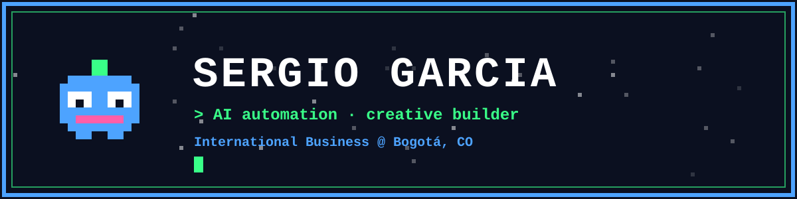

**🇪🇸 Español · [🇬🇧 English below](#-english)**

## 👾 Hola, soy Sergio

Estudiante de **Negocios Internacionales** (VIII semestre, Bogotá 🇨🇴) que resuelve problemas operativos con la herramienta que el problema pida: **IA generativa, automatización, código y datos**. No vengo de ingeniería; aprendo construyendo.

- 🤖 Automatizo procesos y conecto herramientas y agentes de IA para que hagan el trabajo repetitivo.
- 🎨 Creo contenido y diseños con IA: flujos para publicaciones profesionales y modelado 3D.
- 🧪 Exploro herramientas nuevas constantemente y las llevo al límite.
- 🌎 Busco un rol **remoto** en automatización, datos, negocios o mercadeo.

## 🕹️ Proyectos

| Proyecto | Qué es | Estado |
|---|---|---|
| **Sistema de proveedores y contratos** | Automatización sobre Google Workspace (Sheets, Gmail, Drive) con Apps Script: solicitudes automáticas, detección de respuestas por niveles de certeza (los casos ambiguos pasan a revisión humana) y dashboards de cumplimiento. Sin herramientas de pago. Hecho en mi práctica en Smart Training Society. | ✅ En uso |
| **Flujo de contenido con IA** | Claude conectado a distintas herramientas para generar publicaciones/pósters profesionales. | 🔧 En construcción |
| **Juego estilo kart** | Prototipo hecho con Claude Code y Antigravity. | 🔧 En construcción |
| **Oficina virtual de tendencias 3D** | Espacio virtual para explorar tendencias de figuras 3D. | 🧪 Prototipo |

> 📌 Agrega aquí los enlaces a cada repo cuando estén publicados.

## 🧰 Stack

**IA y agentes**

**Automatización**

**Diseño y 3D**

**Negocios y datos**

## 📫 Contacto

 

---

## 🇬🇧 English

### 👾 Hi, I'm Sergio

**International Business** student (8th semester, Bogotá 🇨🇴) who solves operational problems with whatever tool the problem calls for: **generative AI, automation, code and data**. I don't come from an engineering background; I learn by building.

- 🤖 I automate processes and connect AI tools and agents to handle repetitive work.
- 🎨 I create content and designs with AI: professional-post workflows and 3D modeling.
- 🧪 I constantly explore new tools and push them to their limits.
- 🌎 Looking for a **remote** role in automation, data, business or marketing.

### 🕹️ Projects

| Project | What it is | Status |
|---|---|---|
| **Supplier & contract system** | Google Workspace automation (Sheets, Gmail, Drive) with Apps Script: automatic document requests, confidence-tiered reply detection (ambiguous cases go to human review) and compliance dashboards. Zero paid tools. Built during my internship at Smart Training Society. | ✅ In use |
| **AI content workflow** | Claude connected to several tools to generate professional posts/posters. | 🔧 In progress |
| **Kart-style game** | Prototype built with Claude Code and Antigravity. | 🔧 In progress |
| **3D trends virtual office** | Virtual space to explore 3D figure trends. | 🧪 Prototype |

### 🧰 Stack
Claude Code · Gemini · Local LLM (Qwen) · Apps Script · n8n · Make · Blender · Inkscape · Canva · Bambu Studio · Bloomberg Market Concepts · Excel

### 📫 Contact
[LinkedIn](https://linkedin.com/in/sergio-david-garcia-celis-836b8a250) · [dsergio909@gmail.com](mailto:dsergio909@gmail.com)
